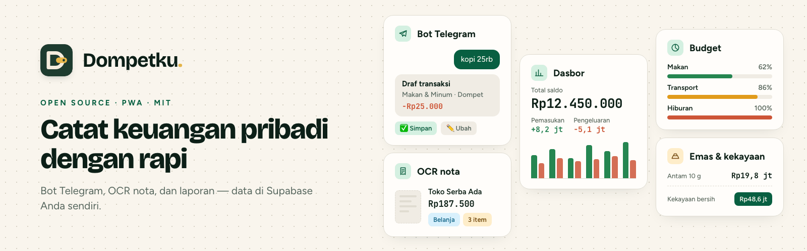
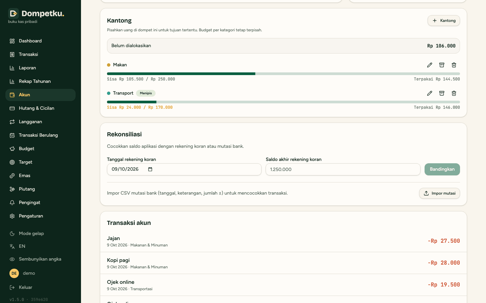

[English](README.md) · **Bahasa Indonesia**

# Dompetku

**Aplikasi pencatat keuangan pribadi open source & self-hosted, lengkap dengan bot Telegram dan OCR struk.**

### 🚀 [Coba demo → demo.dompetku.ilramdhan.dev](https://demo.dompetku.ilramdhan.dev)

Akun demo tertera di halaman login (cukup klik **Masuk ke demo**). Datanya fiktif dan di-reset
setiap hari pukul 00.00 WIB.

⭐ Kalau Dompetku bermanfaat, [kasih bintang di GitHub](https://github.com/ilramdhan/dompetku/stargazers)
ya — biar makin banyak orang yang menemukannya.

Dompetku membantu kamu mencatat pemasukan, pengeluaran, transfer, cicilan, langganan, anggaran,
target tabungan, emas, sampai piutang — semuanya di satu tempat. Catat kopi cukup dengan mengirim
_"kopi 25rb"_ ke bot Telegram milikmu sendiri, atau foto struk belanja dan biarkan AI mengisi
detailnya. Semua data tersimpan di database Supabase **milikmu** dan deployment Vercel
**milikmu**, jadi data keuanganmu tetap jadi milikmu.

Dibuat untuk **kamu dan keluarga**: login pemilik diatur lewat environment variable, lalu pemilik
bisa menambahkan **anggota keluarga** dari web, masing-masing hanya bisa mengakses dompet yang kamu
pilih (lihat saja atau kelola). Tanpa halaman daftar, tanpa server bersama. Tampilan tersedia dalam
**Bahasa Indonesia dan Inggris**, dan nominal mendukung **IDR dan USD**.

Dokumentasi lengkap (panduan instalasi, environment variable, arsitektur) masih dalam bahasa
Inggris — lihat [README.md](README.md) dan folder [docs/](docs).

## Fitur utama

- **Pemasukan, pengeluaran dan transfer** antar rekening (bank, e-wallet, tunai, dan lainnya) dengan
  saldo yang selalu terkini; nominal **IDR dan USD** dengan kurs harian otomatis.
- **Utang dan cicilan** (paylater, pinjaman), **langganan** bulanan/tahunan, **biaya admin**
  rekening, dan **transaksi berulang** (gaji, sewa, transfer rutin) yang tercatat otomatis.
- **Split transaksi**, **hingga 5 foto struk** per transaksi (tersimpan privat) dan pencarian
  berdasarkan nama item di struk; **impor CSV** dengan pratinjau dan deteksi duplikat.
- **Anggaran per kategori** dengan **rollover** dan **peringatan 80% dan 100%** di web dan bot.
- **Target tabungan** dan **Kantong** di dalam dompet: sisihkan sebagian uang satu dompet (mis.
  Mandiri → Makan 500rb, Transport 250rb) dengan peringatan saat kantong menipis.
- **Tabungan emas** dengan harga harian Antam dan dunia (XAU), **piutang** dengan pembayaran
  sebagian, dan **kekayaan bersih** yang menghitung saldo, emas dan piutang.
- **Multi-user (keluarga)** dengan akses per dompet (lihat atau kelola).
- **Bot Telegram**: catat lewat chat (`kopi 25rb`, `gaji masuk 8jt ke BCA`) atau kirim foto struk;
  setiap entri tampil sebagai **pratinjau dengan tombol** sebelum disimpan.
- **OCR struk** di web dan bot memakai penyedia AI apa pun yang kompatibel dengan OpenAI (mis.
  Google Gemini atau OpenAI).
- **Pengingat tagihan** lewat Telegram atau email plus laporan harian, mingguan dan bulanan lewat
  workflow [n8n](https://n8n.io) siap impor.
- **Laporan**: dashboard arus kas, rekap tahunan yang bisa dicetak, laporan per rekening dengan
  **rekonsiliasi mutasi bank**, dan log aktivitas.
- **Keamanan dan privasi**: browser tidak pernah mengakses database langsung, login dua langkah
  (TOTP) opsional, dan **mode privasi** (<kbd>Shift</kbd>+<kbd>H</kbd>) untuk menyembunyikan
  semua nominal.
- **Backup dan restore** dalam satu file JSON, bisa dipasang sebagai aplikasi (PWA), tema
  terang/gelap, dan desain yang nyaman di HP.

## Tangkapan layar

  <picture><source media="(prefers-color-scheme: dark)" srcset="public/screenshots/dashboard-dark.png"></picture>

<table>
  <tr>
    <td width="50%" valign="top"><picture><source media="(prefers-color-scheme: dark)" srcset="public/screenshots/transactions-dark.png"></picture> <b>Transaksi</b>: Cari, filter dan urutkan semua transaksi; impor/ekspor CSV dan PDF.</td>
    <td width="50%" valign="top"><picture><source media="(prefers-color-scheme: dark)" srcset="public/screenshots/reports-dark.png"></picture> <b>Laporan</b>: Tren kategori 6 atau 12 bulan dan rekap tahunan.</td>
  </tr>
  <tr>
    <td width="50%" valign="top"><picture><source media="(prefers-color-scheme: dark)" srcset="public/screenshots/budgets-dark.png"></picture> <b>Anggaran</b>: Anggaran bulanan dengan rollover dan peringatan 80% / 100%.</td>
    <td width="50%" valign="top"><picture><source media="(prefers-color-scheme: dark)" srcset="public/screenshots/accounts-pockets-dark.png"></picture> <b>Kantong</b>: Amplop di dalam dompet beserta sisa bulan ini.</td>
  </tr>
  <tr>
    <td width="50%" valign="top"><picture><source media="(prefers-color-scheme: dark)" srcset="public/screenshots/goals-dark.png"></picture> <b>Target tabungan</b>: Progres, target bulanan dan perkiraan tanggal tercapai.</td>
    <td width="50%" valign="top"><picture><source media="(prefers-color-scheme: dark)" srcset="public/screenshots/gold-dark.png"></picture> <b>Emas</b>: Harga emas Antam dan dunia dengan keuntungan belum terealisasi.</td>
  </tr>
</table>

  <picture><source media="(prefers-color-scheme: dark)" srcset="public/screenshots/dashboard-mobile-dark.png"></picture>
  <picture><source media="(prefers-color-scheme: dark)" srcset="public/screenshots/telegram-bot-dark.png"></picture>

Semua tangkapan layar ada di [README.md](README.md#screenshots).

## Cara deploy singkat (~20 menit)

Kamu butuh akun gratis di [GitHub](https://github.com), [Supabase](https://supabase.com) dan
[Vercel](https://vercel.com). Tidak perlu ngoding.

1. **Fork** repository ini ke akun GitHub-mu.
2. **Buat project Supabase**, buka **SQL Editor**, tempel isi
   [`supabase/schema.sql`](supabase/schema.sql) lalu klik **Run**.
3. **Impor fork-mu ke Vercel** (atau pakai tombol di bawah).
4. **Isi environment variable wajib**: `SUPABASE_URL`, `SUPABASE_SERVICE_ROLE_KEY`,
   `APP_USERNAME`, `APP_PASSWORD` dan `SESSION_SECRET` (string acak minimal 32 karakter).
5. **Deploy, buka situsmu, lalu login.** Bot Telegram, OCR dan pengingat bisa ditambahkan nanti.

> [!IMPORTANT]
> Tombol di atas hanya men-deploy aplikasi; kamu tetap harus menjalankan `supabase/schema.sql` di
> project Supabase (langkah 2) sebelum login. Jangan pernah membagikan
> `SUPABASE_SERVICE_ROLE_KEY` — kunci itu memberi akses penuh ke database-mu.

Panduan lengkap langkah demi langkah ada di **[docs/SELF-HOSTING.md](docs/SELF-HOSTING.md)**
(ringkasannya di [docs/SETUP.md](docs/SETUP.md)), dan semua environment variable dijelaskan di
[docs/ENVIRONMENT.md](docs/ENVIRONMENT.md).

## Kontribusi

Kontribusi sangat diterima, mulai dari perbaikan typo dan terjemahan sampai fitur baru. Baca dulu
[CONTRIBUTING.md](CONTRIBUTING.md) dan [Code of Conduct](CODE_OF_CONDUCT.md). Sebelum membuka pull
request, pastikan `npm run lint`, `npm run typecheck`, `npm test` dan `npm run build` lolos.
Masalah keamanan dilaporkan secara privat lewat [SECURITY.md](SECURITY.md), bukan lewat issue
publik.

Ingin langsung mulai tanpa setup? Buka repo di GitHub Codespaces: dev container sudah memasang
dependensi dan Docker, jadi `npm run db:up`, `npm run dev` dan `npm test` langsung bisa dipakai.

## Dukungan

Kalau Dompetku bermanfaat buatmu:

- ⭐ Beri bintang di [GitHub](https://github.com/ilramdhan/dompetku) dan bagikan ke teman.
- 💚 Dukung pengembangannya lewat [GitHub Sponsors](https://github.com/sponsors/ilramdhan),
  [Saweria](https://saweria.co/ilramadhan) atau [Ko-fi](https://ko-fi.com/ilramdhan_).
- 💬 Kirim masukan, ide atau laporan bug di [GitHub Issues](https://github.com/ilramdhan/dompetku/issues).

## Kontributor

Terima kasih untuk semua yang sudah ikut membangun Dompetku. Ingin ikut? Pilih [good first issue](https://github.com/ilramdhan/dompetku/issues?q=is%3Aissue+is%3Aopen+label%3A%22good+first+issue%22).

## Riwayat star

<a href="https://star-history.com/#ilramdhan/dompetku&Date">
  <picture>
    <source media="(prefers-color-scheme: dark)" srcset="https://api.star-history.com/svg?repos=ilramdhan/dompetku&type=Date&theme=dark">
    
  </picture>
</a>

## Lisensi

Dirilis di bawah [Lisensi MIT](LICENSE). Hak cipta (c) 2026 Ilham Ramadhan.
