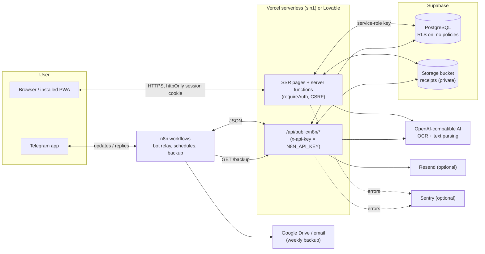
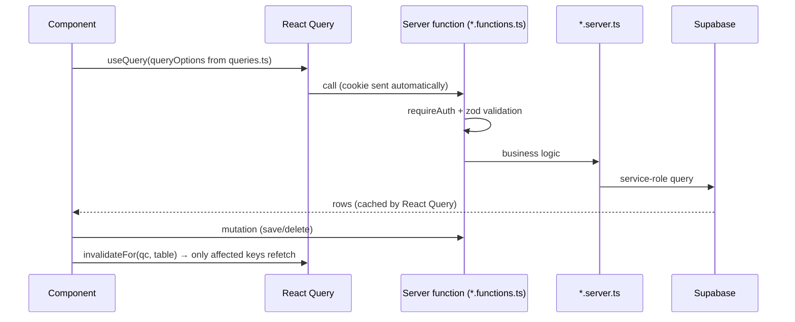
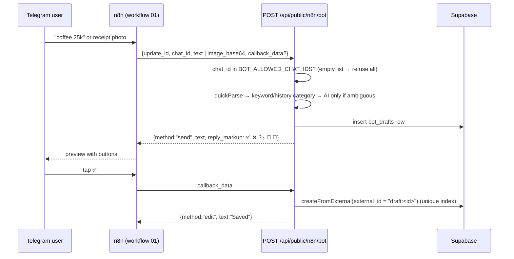

# Architecture

This document explains how Dompetku is put together: which tools it uses and why, where things
live in the repository, how the main features work behind the scenes, and the rules a contributor
must follow. It is written for developers, but every section starts with a plain-language summary
so you can follow along even if you are new to web development.

> [!TIP]
> Just want to run your own copy? You do not need any of this. Follow
> [SELF-HOSTING.md](SELF-HOSTING.md) instead.

- [Big picture](#big-picture)
- [Tech stack](#tech-stack)
- [System diagram](#system-diagram)
- [Directory structure](#directory-structure)
- [Database schema sections (v1–v15)](#database-schema-sections-v1v15)
- [Key flows](#key-flows)
- [Conventions and contributor rules](#conventions-and-contributor-rules)
- [Testing and CI](#testing-and-ci)

## Big picture

Dompetku is a **single-user** personal finance app. In plain words:

- The **web app** (what you open in your browser) and the **server code** live in the same
  project. The browser never talks to the database directly; it always asks the server, and the
  server checks that you are logged in first.
- The **database** is a Supabase (hosted PostgreSQL) project that _you_ own. Only the server holds
  the secret key to it.
- The **Telegram bot** and **scheduled jobs** (reminders, reports, backups) run through
  [n8n](https://n8n.io), an automation tool. n8n is deliberately "thin": it only forwards messages
  and timers to the app's API. All the actual logic (parsing, OCR, reports) is in this repository,
  where it is tested.
- **AI** (reading receipt photos and understanding chat messages like "coffee 25k") goes through
  any OpenAI-compatible API, so you can pick your provider.

## Tech stack

Versions are taken from `package.json` (`^` means "this version or a compatible newer one").

| Area               | Technology                                                                 | Version                                       | Why it is used                                                                                                                                           |
| ------------------ | -------------------------------------------------------------------------- | --------------------------------------------- | -------------------------------------------------------------------------------------------------------------------------------------------------------- |
| Framework          | [TanStack Start](https://tanstack.com/start) on React                      | `@tanstack/react-start` 1.168.60, React ^19.2 | Full-stack React: server-side rendering, type-safe **server functions** (RPC from browser to server), file-based routes and API routes in one codebase.  |
| Routing            | [TanStack Router](https://tanstack.com/router)                             | 1.170.41                                      | Type-safe, file-based routing (`src/routes`), loaders and route-level error boundaries.                                                                  |
| Data fetching      | [TanStack Query](https://tanstack.com/query)                               | ^5.101                                        | Client cache for server-function results, background refetch and targeted invalidation after edits.                                                      |
| Build              | [Vite](https://vite.dev) + [nitro](https://nitro.build)                    | Vite 8.1.5, nitro 3.0 beta                    | Fast dev server and production build. nitro packages the server for the target host (Vercel preset when the `VERCEL` env var is set; Lovable otherwise). |
| Styling            | [Tailwind CSS](https://tailwindcss.com) v4                                 | ^4.2                                          | Utility CSS with semantic color tokens so light and dark themes share the same markup.                                                                   |
| UI components      | [shadcn/ui](https://ui.shadcn.com) on [Radix UI](https://www.radix-ui.com) | Radix 1.x/2.x                                 | Accessible, unstyled primitives (dialogs, selects, menus) copied into `src/components/ui` and themed locally.                                            |
| Icons              | [lucide-react](https://lucide.dev)                                         | ^0.575                                        | Consistent icon set.                                                                                                                                     |
| Charts             | [Recharts](https://recharts.org)                                           | ^2.15                                         | Dashboard and report charts. Loaded **lazily** through wrappers in `src/components/charts` to keep the first page load small.                            |
| Forms & validation | [zod](https://zod.dev) + react-hook-form                                   | zod ^3.25, RHF ^7.71                          | One schema validates input in the browser and again on the server (`src/lib/schemas.ts`).                                                                |
| Dates              | date-fns                                                                   | ^4.1                                          | Date math for periods, due dates and schedules.                                                                                                          |
| Database           | [Supabase](https://supabase.com) PostgreSQL via `@supabase/supabase-js`    | ^2.117                                        | Hosted Postgres with a free tier. Used **server-only** with the service-role key; RLS is enabled with **no policies**, so public keys can read nothing.  |
| File storage       | Supabase Storage                                                           | —                                             | Private `receipts` bucket for receipt photos, viewed through short-lived signed URLs.                                                                    |
| Hosting            | [Vercel](https://vercel.com) (region `sin1`, see `vercel.json`) or Lovable | —                                             | Serverless functions; the bot endpoint gets a 60 s limit for OCR (see `vite.config.ts`).                                                                 |
| Tests              | [Vitest](https://vitest.dev) + Testing Library + jsdom                     | Vitest ^4.1                                   | Unit tests for all pure logic plus a few component tests.                                                                                                |
| Lint & format      | ESLint 9 + typescript-eslint, Prettier 3                                   | —                                             | Consistent code style; `npm run lint` must pass in CI.                                                                                                   |
| CI                 | GitHub Actions (`.github/workflows/ci.yml`)                                | —                                             | Runs lint, typecheck, test and build on every pull request and push to `main`.                                                                           |
| Automation         | [n8n](https://n8n.io)                                                      | any recent                                    | Receives Telegram updates and runs schedules (reminders, reports, weekly backup) by calling `/api/public/n8n/*`.                                         |
| Chat bot           | Telegram Bot API                                                           | —                                             | Record transactions by chat or receipt photo, with inline buttons.                                                                                       |
| AI                 | Any OpenAI-compatible chat-completions API (`AI_API_URL`)                  | —                                             | Receipt OCR (vision model) and parsing of ambiguous chat messages (optionally a cheaper text model).                                                     |
| Email              | [Resend](https://resend.com) over plain `fetch`                            | —                                             | Optional direct reminder emails (n8n can send email instead).                                                                                            |
| Error monitoring   | [Sentry](https://sentry.io) (optional)                                     | no SDK                                        | Errors are posted as a Sentry "envelope" with `fetch`, so there is no SDK dependency. Without `SENTRY_DSN` errors are still logged as JSON lines.        |
| Fonts              | Bricolage Grotesque, Figtree, JetBrains Mono (from Fontsource)             | —                                             | Self-hosted in `public/fonts` (SIL Open Font License), so no third-party font requests.                                                                  |

Other external services used by the server: [open.er-api.com](https://open.er-api.com) for the
USD→IDR rate (with `FALLBACK_USD_IDR` as backup), [gold-api.com](https://gold-api.com) for the
world gold price and the public Antam (Logam Mulia) price page for Indonesian gold prices.

## System diagram



## Directory structure

Generated from `git ls-files`. `src/components/ui` (46 shadcn/ui files) and `public/icons` are
collapsed. Lovable planning drafts in `.lovable/` are omitted.

```text
.
├── .github/
│   ├── workflows/ci.yml           # CI: lint, typecheck, test, build
│   └── pull_request_template.md
├── AGENTS.md                      # Architecture rules for humans and AI agents (source of truth)
├── README.md
├── docs/                          # All documentation (this file, self-hosting, env, n8n, FAQ)
├── n8n/                           # Importable n8n workflow templates (01–05) + README
├── public/
│   ├── favicon.png
│   ├── fonts/                     # Self-hosted woff2 fonts + LICENSE-OFL.txt
│   ├── icons/                     # PWA icons (collapsed)
│   ├── manifest.webmanifest       # PWA manifest (no service worker)
│   └── robots.txt
├── supabase/schema.sql            # Full database schema, sections v1–v15, safe to re-run
├── src/
│   ├── server.ts                  # Server entry wrapper: catches SSR errors → logError + error page
│   ├── start.ts                   # Global request middleware: security headers, error page, CSRF
│   ├── router.tsx                 # Router + QueryClient; "Unauthorized" → clear session cache, go to /login
│   ├── routeTree.gen.ts           # Auto-generated by TanStack Router (never edit)
│   ├── styles.css                 # Tailwind v4, semantic color tokens, @font-face, print styles
│   ├── assets/app-icon.png
│   ├── hooks/use-mobile.tsx
│   ├── routes/                    # File-based routes (see src/routes/README.md)
│   │   ├── __root.tsx             # HTML shell, pre-paint theme/privacy script, fonts, manifest
│   │   ├── index.tsx              # "/" → redirects to dashboard or login
│   │   ├── login.tsx              # Login form (+ TOTP step when enabled)
│   │   ├── _app.tsx               # Authenticated layout (session check, app shell)
│   │   ├── _app/                  # Pages: dashboard, transactions, reports, rekap (yearly),
│   │   │                          #   accounts, accounts_.$id (account report), debts, subscriptions,
│   │   │                          #   recurring, budgets, goals, gold, receivables, reminders, settings
│   │   └── api/public/n8n/        # API for n8n: bot, message, ocr, transactions, command, report,
│   │                              #   summary, reminders, reminders-email, reminders-send-email, backup
│   ├── components/
│   │   ├── app-shell.tsx          # Navigation, theme / language / privacy toggles, PageHeader
│   │   ├── crud-page.tsx          # Generic list + create/edit/delete page used by many sections
│   │   ├── transaction-dialog.tsx # Add/edit transaction (fees, receipts, split)
│   │   ├── receipt-scanner.tsx, receipt-gallery.tsx, split-editor.tsx, csv-import.tsx,
│   │   │   backup-restore.tsx, two-factor-card.tsx, account-reconcile.tsx, assets-overview.tsx, …
│   │   ├── charts/                # Lazy Recharts wrappers (index.tsx is the only public entry)
│   │   └── ui/                    # shadcn/ui primitives (collapsed)
│   ├── lib/                       # Business logic (see table below)
│   └── test/                      # Vitest suites (*.test.ts / *.test.tsx) + setup.ts
├── .env.example                   # Every environment variable with a short comment
├── vite.config.ts                 # Lovable/TanStack config; Vercel nitro preset when VERCEL is set
├── vercel.json                    # Vercel region (sin1)
├── vitest.config.ts, eslint.config.js, tsconfig.json, components.json, .prettierrc
└── package.json, bun.lock
```

### `src/lib` at a glance

File-name suffixes tell you where code may run:

| Suffix / file          | Runs where                                  | Meaning                                                                                                          |
| ---------------------- | ------------------------------------------- | ---------------------------------------------------------------------------------------------------------------- |
| `*.server.ts`          | Server only                                 | Touches the database, secrets or external APIs. Never import from a component.                                   |
| `*.functions.ts`       | Called from the browser, runs on the server | `createServerFn` endpoints. Each data function uses the `requireAuth` middleware and delegates to `*.server.ts`. |
| plain `*.ts` / `*.tsx` | Anywhere                                    | Pure, client-safe helpers. These are where unit tests focus.                                                     |

| File                                                                          | Purpose                                                                                                                |
| ----------------------------------------------------------------------------- | ---------------------------------------------------------------------------------------------------------------------- |
| `db.server.ts`                                                                | The single Supabase client (service-role key), typed with `database.types.ts`.                                         |
| `database.types.ts`                                                           | Generated DB types (`npm run gen:types`); optional columns/tables added by hand.                                       |
| `session.server.ts`, `auth.functions.ts`, `auth-middleware.ts`                | Credential check, HMAC-signed cookie, login/logout/2FA server functions, `requireAuth`.                                |
| `totp.ts` / `totp.server.ts`                                                  | Pure TOTP (RFC 6238) helpers / verification against `APP_TOTP_SECRET`.                                                 |
| `login-throttle.ts` / `login-throttle.server.ts`                              | Brute-force limit (8 failures per 15 min) counted from `activity_log`, with in-memory fallback.                        |
| `session-cache.ts`                                                            | 5-minute client-side cache of the session check to avoid a round-trip on every navigation.                             |
| `api-key.server.ts`                                                           | `x-api-key` / Bearer check against `N8N_API_KEY` (timing-safe, ≥ 24 chars required).                                   |
| `finance.server.ts` / `finance.functions.ts`                                  | Core business logic shared by web and bot: CRUD, dashboard, reminders, fees, FX, external transactions, email sending. |
| `queries.ts`                                                                  | React Query keys/options and the `invalidateFor(qc, table)` map (`AFFECTS`).                                           |
| `schemas.ts`                                                                  | zod schemas for every form/entity.                                                                                     |
| `paginate.ts`                                                                 | `fetchAll` (pages past PostgREST's 1000-row cap) and validated page/sort params.                                       |
| `aggregate.ts`                                                                | Report helpers: call `dk_*` Postgres functions, JS fallback with identical results; `isMissingFunction`.               |
| `account-report.ts` / `.server.ts` / `.functions.ts`                          | Per-account monthly flows, balance chart and bank reconciliation.                                                      |
| `bot.ts` / `bot.server.ts` / `bot-request.ts`                                 | Telegram bot: pure parsing, commands, keyboards / DB work and drafts / request size guard (413).                       |
| `ocr.server.ts`                                                               | Calls the AI endpoint for receipt OCR and text parsing.                                                                |
| `receipt.server.ts`, `receipts.ts`                                            | Private bucket, uploads, signed URLs / pure helpers for up to 5 photos.                                                |
| `split.ts` / `.server.ts` / `.functions.ts`                                   | Split one receipt into several expense rows.                                                                           |
| `recurring.ts` / `.server.ts` / `.functions.ts`                               | Recurring transaction scheduling and lazy application.                                                                 |
| `budget.ts` / `budget.server.ts`                                              | Rollover math, 80%/100% threshold crossing / alert dedupe.                                                             |
| `fees.ts`                                                                     | Transfer/top-up/monthly fee parsing and dedupe markers.                                                                |
| `goals.ts`                                                                    | Savings goal progress helpers.                                                                                         |
| `assets.ts` / `assets.server.ts`                                              | Gold & receivable math / gold prices cache and `saveGold`.                                                             |
| `csv.ts`, `email.ts`                                                          | CSV import preview and reminder email builder (pure, shared).                                                          |
| `backup.ts` / `.server.ts` / `.functions.ts`                                  | Restore validation, FK order (`RESTORE_TABLES`), chunked upserts, export.                                              |
| `monitoring.ts` / `monitoring.server.ts`, `error-capture.ts`, `error-page.ts` | Structured error logs, Sentry envelope, SSR error recovery and fallback page.                                          |
| `activity.ts`                                                                 | Labels for `activity_log` actions.                                                                                     |
| `privacy.ts`, `privacy-sync.tsx`, `format.ts`                                 | Privacy-mode store and masking-aware `money()` / `compact()` formatters.                                               |
| `i18n.tsx`                                                                    | `LanguageProvider` / `useI18n`, ID→EN dictionary.                                                                      |
| `dates.ts`, `head.ts`, `utils.ts`                                             | Date helpers, page `<head>` helper, `cn()` class merge.                                                                |

## Database schema sections (v1–v15)

`supabase/schema.sql` is one file, organised in sections that are **safe to re-run** (`if not
exists` everywhere). A fresh install runs the whole file once. Existing installs run any newer
section. Every section after v1 is optional: the related feature hides itself or falls back until
the section is run.

| Section | Adds                                                                                                                                                                                                                            |
| ------- | ------------------------------------------------------------------------------------------------------------------------------------------------------------------------------------------------------------------------------- |
| v1      | Core tables: `accounts`, `categories`, `transactions`, `debts`, `debt_payments`, `subscriptions`, `budgets`, `goals`, `activity_log`, `fx_rates`; `account_balances` view; grants (service_role only); RLS; default categories. |
| v2      | `transactions.receipt_path` and the private `receipts` storage bucket (5 MB limit).                                                                                                                                             |
| v3      | `activity_log` (if missing), gold (`gold_purchases`, `gold_prices`) and receivables (`receivables`, `receivable_payments`).                                                                                                     |
| v4      | Account fees (`transfer_fees`, `topup_fees`, `monthly_fee`, `monthly_fee_day`), subscription `tax_percent`, index for auto-fee markers.                                                                                         |
| v5      | Gold metadata (`gold_type`, `product_number`) and main query indexes.                                                                                                                                                           |
| v6      | Gold linked to an account and a transaction (`account_id`, `transaction_id`).                                                                                                                                                   |
| v7      | Telegram bot: `transactions.external_id` (unique) for idempotency, `bot_drafts` previews.                                                                                                                                       |
| v8      | Savings goals linked to an account (`goals.account_id`).                                                                                                                                                                        |
| v9      | Report aggregation functions `dk_month_totals`, `dk_category_totals`, `dk_month_category_totals`, `dk_monthly_net`.                                                                                                             |
| v10     | `recurring_transactions`.                                                                                                                                                                                                       |
| v11     | Budget `rollover` flag and `budget_alerts`.                                                                                                                                                                                     |
| v12     | Split transactions (`split_group`), multiple photos (`receipt_paths`), generated `items_search` column for receipt item search.                                                                                                 |
| v13     | `dk_account_monthly` function and `account_reconciliations`.                                                                                                                                                                    |
| v14     | `app_settings` (single row: name, tagline, logo data URL, time zone, base currency, landing, bot default account, reminder days).                                                                                               |
| v15     | `ai_usage` log (one row per AI call: source, chat, kind, model, tokens) for the bot daily AI quota.                                                                                                                             |

## Key flows

### Authentication and request security

1. The login form calls the `login` server function. It first checks the **throttle** (8 failures
   in 15 minutes locks login), then compares username/password with `APP_USERNAME` /
   `APP_PASSWORD` using timing-safe hashing.
2. If `APP_TOTP_SECRET` is set, a 6-digit TOTP code is also required (any authenticator app).
3. On success the server sets `dk_session`: a base64url payload `{u, exp}` plus an
   **HMAC-SHA256 signature** with `SESSION_SECRET` (≥ 32 chars). The cookie is `httpOnly`,
   `secure`, `SameSite=None; Partitioned` (so Lovable's iframe preview works) and lasts 7 days.
4. Every data server function uses the `requireAuth` middleware, which verifies the signature and
   expiry. Failures throw `Unauthorized`; `router.tsx` then clears the client session cache and
   redirects to `/login`.
5. Global request middleware in `src/start.ts` adds **CSRF protection** to server functions
   (TanStack's `createCsrfMiddleware`) and baseline security headers (`X-Content-Type-Options`,
   `Referrer-Policy`, `Permissions-Policy`). There is intentionally no `X-Frame-Options`/CSP
   because Lovable previews run in an iframe.
6. n8n routes do not use the cookie. They require `x-api-key: <N8N_API_KEY>` (or
   `Authorization: Bearer`); a missing or short key makes them answer `503`.

### Data access and caching



- The browser never receives the Supabase key; everything goes through server functions.
- After a create/update/delete, call `invalidateFor(qc, table)`. The `AFFECTS` map in
  `queries.ts` lists which query keys each table touches (for example, a transaction change
  refreshes balances, dashboard and reports). Never call a blanket `invalidateQueries()`.
- Long history lists (transactions, activity) use validated **server-side pagination and
  sorting**. Small dashboard widgets and form dropdowns load bounded/full lists.
- `session-cache.ts` remembers a successful session check for 5 minutes in the browser so page
  changes do not wait for a server round-trip. Security is still enforced by `requireAuth`.

### Telegram bot (draft → ✅ idempotency)



- Logic lives in the web app (`bot.ts` pure, `bot.server.ts` DB). n8n only relays
  `{method, text, reply_markup}` to the Telegram Bot API.
- Double taps and retries are harmless: the unique `external_id` makes the save idempotent.
- AI results are snapped to existing categories/accounts (`matchCategory`); the bot never
  creates categories. `BOT_TEXT_AI` (`auto` / `always` / `never`) and `AI_MODEL_TEXT` control token
  spend; chats without an amount or over 300 characters skip AI, and `BOT_AI_DAILY_LIMIT` caps
  bot AI calls per chat per day (logged in `ai_usage`). Requests over 4.5 MB are rejected early with `413` (`bot-request.ts`).
- On Vercel, `/api/public/n8n/bot` is emitted as its own function with `maxDuration: 60` because
  OCR can take 5–15 seconds.

### Receipt OCR

The web scanner (`receipt-scanner.tsx`) and the bot both send the image to `ocr.server.ts`, which
calls `AI_API_URL` with `AI_MODEL` (a vision model) and asks for structured JSON (merchant, date,
total, items). The result pre-fills a transaction (web) or a draft (bot); the user confirms before
anything is saved. Item names are stored and searchable (v12 `items_search`).

### Receipt storage and signed URLs

Photos are uploaded by the server into the private `receipts` bucket (lazy-created by
`receipt.server.ts` if missing). Transactions store only paths: `receipt_paths` (up to 5) with
`receipt_path` = the first, for compatibility. To view a photo the server creates a **signed URL
valid for 5 minutes**. When a transaction is deleted, photos are removed only if no other row
(for example another part of a split) still references them.

### Reminders, monthly fees and recurring transactions (lazy jobs)

There is no cron inside the app. Instead, work that "should happen monthly" runs **lazily** the
next time it matters:

- When the dashboard, reminders or the bot load, `applyMonthlyFees()` creates any due monthly
  account fee as an expense in category "Biaya Admin", then `applyRecurring()` posts due recurring
  transactions.
- Both are **idempotent**: fees are deduplicated by a notes marker from `fees.ts`; recurring items
  by a notes marker plus `external_id`. Recurring application never throws.
- Reminders (`/reminders`, `/api/public/n8n/reminders`, `-email`, `-send-email`) list upcoming
  subscription and installment bills. n8n workflow 02 calls them on a schedule; direct email uses
  Resend when `RESEND_API_KEY` / `EMAIL_FROM` / `EMAIL_TO` are set.

### Budgets: rollover and alerts

`budget.ts` holds pure math: unused budget can roll over to the next month, and a function
detects when spending **crosses** 80% or 100%. After a web or bot save, `budgetAlertsFor()` checks
the affected budget, records the alert in `budget_alerts` (once per budget per month) and returns
a message. Alerts never cause a save to fail.

### Split transactions

A split is N ordinary expense rows sharing a `split_group` UUID, so reports and budgets work
without special cases. `split.server.ts` saves/deletes the group as a unit.

### Fees, gold and receivables

- Transfer, top-up and monthly account fees are separate expense transactions in category
  "Biaya Admin".
- Gold records linked to an account create an expense (buy) or income (sell) transaction in
  category "Emas" (`saveGold`); edits sync it and deletes remove it.
- Linked receivables move money as transactions in category "Piutang".
- Net worth = account balances + outstanding linked receivables + gold value, so these count as
  assets exactly once.
- Gold prices (world XAU and Antam) are cached one row per day per source in `gold_prices`, with
  "last cached" and then "estimate" fallbacks.

### Reports aggregation

Reports call Postgres functions (`dk_*`, v9/v13, executable only by `service_role`) through
helpers in `aggregate.ts` / `account-report.server.ts`. If the function does not exist yet
(`isMissingFunction()`), the code falls back to fetching rows and summing them in JavaScript,
producing identical results. Because PostgREST returns at most 1000 rows per request, the fallback
uses `fetchAll` (`paginate.ts`), which pages with `.range()` and a stable order up to a 100,000-row
safety cap.

### Backup and restore

- **Export**: Settings → backup downloads one JSON file with every table (`exportBackup()`); n8n
  workflow 05 fetches the same file from `GET /api/public/n8n/backup` weekly and stores it in
  Google Drive or sends it by email.
- **Restore**: `backup.ts` validates the file, orders tables by foreign keys (`RESTORE_TABLES`),
  remaps natural-key conflicts in merge mode and strips generated columns. The browser sends the
  data in chunks (≤ 500 rows / ≤ 2 MB per request, files up to 20 MB) to stay under Vercel's
  4.5 MB body limit. "Replace" mode deletes current data first and requires typing a confirmation
  word. Tables missing from the database are skipped.

### Monitoring

All server errors go through `logError()` (`monitoring.server.ts`): one JSON line in the host's
logs (Vercel → Logs) and, if `SENTRY_DSN` is set, a Sentry envelope sent with `fetch`. It never
throws. `server.ts` and `start.ts` catch SSR failures and return a friendly error page.

### App version and update check

`vite.config.ts` injects `__APP_VERSION__` (package.json), `__APP_COMMIT__` (`VERCEL_GIT_COMMIT_SHA`
or `git rev-parse`, empty if unavailable) and `__APP_BUILD_DATE__` via `define` (declared in
`src/version.d.ts`). Pure helpers in `version.ts` (semver compare, repo parsing, release URLs) fall
back safely under vitest. `getLatestRelease` (public, `version.server.ts`) asks the GitHub releases
API with a 3 s timeout and caches 6 h in memory; any failure returns `null`. `<VersionBadge>` renders
it in the sidebar, Settings → About and the landing page.

### Privacy mode

Privacy mode hides money on screen (for example when sharing your screen). The eye icon or
**Shift+H** toggles it per device (`localStorage` key `dk-privacy`). An inline script in
`__root.tsx` adds `.privacy` to `<html>` before the first paint; `PrivacySync` keeps it in sync
after hydration. `money()` / `compact()` return a fixed-length mask when on, and components
showing amounts call `usePrivacy()` to re-render. Percentages and counts stay visible; bot
messages, exports and login are never masked.

### Language (i18n)

The UI is written in Indonesian and translated to English at runtime. `t("Indonesian text")`
returns the input when the language is `id`, or the English entry from the `DICT` in
`i18n.tsx` when it is `en`.

### Dark mode

A `.dark` class on `<html>` (stored in `localStorage` key `dk-theme`) is set by the same
pre-paint inline script, so there is no flash of the wrong theme. All colors are semantic
Tailwind tokens defined in `styles.css`.

### PWA

The app is installable via `public/manifest.webmanifest` and icons. There is **no service
worker** on purpose: it keeps Lovable previews and deployments free of stale caches.

## Conventions and contributor rules

`AGENTS.md` is the authoritative list. The most important rules:

1. **Server-only data access.** Only `*.server.ts` code imports `db()`. Every data server
   function uses `requireAuth`. Never add Supabase keys or clients to browser code.
2. **Shared business logic.** Put logic in `finance.server.ts` (or a focused `*.server.ts`) so
   the web app and the bot/n8n API share it. Keep pure logic in client-safe files with tests.
3. **Graceful degradation.** New tables/columns go into a **new optional schema section**. Reads
   of optional tables go through `isMissingTable()` and return empty/`{ ready: false }`; SQL
   function calls check `isMissingFunction()` and fall back to JS. Pages must never crash because
   a user has not run the newest section.
4. **Money display.** Always format with `money()` / `compact()` and call `usePrivacy()` in the
   component. Use `{ reveal: true }` only in form/editing previews, and `secret()` for sensitive
   non-money values (gold grams).
5. **Styling.** Use semantic color tokens (no hard-coded colors) so both themes work. Design
   mobile-first: every screen must work at phone width without horizontal scrolling. Import
   charts only from `src/components/charts`.
6. **Text.** Wrap every user-visible string in `t("…")` and add its English translation to the
   dictionary in `i18n.tsx`.
7. **Cache invalidation.** After a mutation, call `invalidateFor(qc, table)`; add the table to
   `AFFECTS` in `queries.ts` if it is new.
8. **Errors.** Log server errors with `logError()`.
9. **Lovable sync.** Do not rewrite published git history (no force-push/amend of pushed commits).

### Checklist: adding a new table or feature

- [ ] Add a new section `-- ===== vN: … =====` to `supabase/schema.sql` (idempotent, RLS enabled,
      grants to `service_role` only).
- [ ] Add the table/columns to `src/lib/database.types.ts` (mark optional if the section may not
      have been run), or regenerate with `npm run gen:types`.
- [ ] Read through `isMissingTable()` / `isMissingFunction()` so old databases keep working.
- [ ] Add the table to `RESTORE_TABLES` in `backup.ts` in foreign-key order (and conflict keys).
- [ ] Add the table to the `AFFECTS` map in `queries.ts`.
- [ ] Add activity labels in `activity.ts` (`<table>.create|update|delete`).
- [ ] Wrap new UI text in `t()` and add English entries in `i18n.tsx`.
- [ ] Put pure logic in a client-safe file and add Vitest tests in `src/test`.
- [ ] Update `AGENTS.md` and the docs if you add a rule, env var or endpoint.

## Testing and CI

```bash
npm run lint        # ESLint
npm run typecheck   # tsc --noEmit
npm test            # Vitest, once
npm run test:watch  # Vitest in watch mode
npm run build       # production build
```

- Tests live in `src/test` and mostly cover pure modules (bot parsing, fees, budgets, recurring,
  split, receipts, backup, TOTP, pagination, privacy, monitoring, aggregation). Component tests
  use Testing Library with jsdom (`src/test/setup.ts`).
- The build needs **no secrets**: environment variables are read only at runtime.
- GitHub Actions (`.github/workflows/ci.yml`) installs with Bun and runs lint, typecheck, test and
  build on every pull request and on pushes to `main`. Keep all four green.
