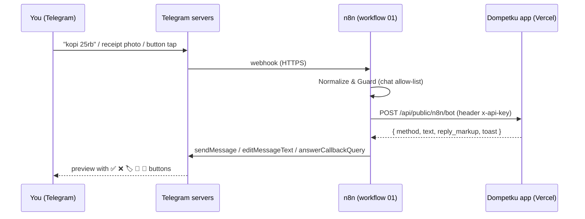

# n8n, Telegram bot, backups & email

This guide sets up everything Dompetku does **outside the browser**: the Telegram bot, scheduled reminders and reports, error alerts, and weekly backups to Google Drive or email. It is written for complete beginners — every click is spelled out — but the tables make it a quick reference for developers too.

> [!NOTE]
> All of this is **optional**. The web app works fine without n8n. Set up the web app first ([docs/SELF-HOSTING.md](SELF-HOSTING.md)), then come back here.

**Contents**

1. [What n8n is and why Dompetku uses it](#1-what-n8n-is-and-why-dompetku-uses-it)
2. [n8n environment variables](#2-n8n-environment-variables)
3. [Credentials](#3-credentials)
4. [Telegram bot](#4-telegram-bot)
5. [Importing the templates](#5-importing-the-templates)
6. [Google Cloud for Drive backups](#6-google-cloud-for-drive-backups)
7. [Email for backups](#7-email-for-backups)
8. [Turning on the email branch in workflow 05](#8-turning-on-the-email-branch-in-workflow-05)
9. [Troubleshooting](#9-troubleshooting)

---

## 1. What n8n is and why Dompetku uses it

[n8n](https://n8n.io) is a visual automation tool: you connect boxes ("nodes") into a "workflow" that runs when something happens (a Telegram message arrives, a clock hits 08:00, …). Dompetku ships five ready-made workflows in the [`n8n/`](../n8n) folder.

In Dompetku, **n8n is only a thin relay — the web app is the brain.** All parsing, OCR, categories, reports and buttons live in the (tested) app code. n8n just moves messages around:

| Job                     | What n8n does                                                                           |
| ----------------------- | --------------------------------------------------------------------------------------- |
| **Telegram relay**      | Receives Telegram updates, forwards them to the app, sends the app's reply back.        |
| **Scheduled reminders** | Every morning/evening/week/month asks the app for due bills or a report → Telegram.     |
| **Error handler**       | If another workflow fails, sends you a Telegram alert.                                  |
| **Backups**             | Every Sunday downloads a full JSON backup and stores it in Google Drive (or emails it). |



### Where to run n8n

| Option                      | Cost                          | Good for                             |
| --------------------------- | ----------------------------- | ------------------------------------ |
| **n8n Cloud** (n8n.io)      | Paid plans after a free trial | No server to manage.                 |
| **Self-hosted with Docker** | Free (you pay for the server) | Full control; a small VPS is plenty. |

> [!IMPORTANT]
> Telegram can only deliver messages to a **public HTTPS URL**. `http://localhost:5678` will not work for the bot. Use n8n Cloud, or self-host behind HTTPS (a reverse proxy such as Caddy/Traefik, a panel like Coolify/Easypanel, or a Cloudflare Tunnel).

> [!WARNING]
> The templates read settings with `$env.…`. Your n8n must allow that: set **`N8N_BLOCK_ENV_ACCESS_IN_NODE=false`** (newer n8n versions block it by default). On n8n Cloud, environment variables may not be available on every plan — in that case replace each `{{ $env.X }}` in the nodes with the literal value.

<details>
<summary><b>Self-hosting with Docker (docker run / docker compose)</b></summary>

**Quick test with `docker run`** (local only — no Telegram webhooks):

```bash
docker volume create n8n_data
docker run -it --rm --name n8n -p 5678:5678 \
  -e N8N_BLOCK_ENV_ACCESS_IN_NODE=false \
  -v n8n_data:/home/node/.n8n \
  docker.n8n.io/n8nio/n8n
```

**Production with `docker compose`** — save as `docker-compose.yml` next to a `.env` file (below), then run `docker compose up -d`:

```yaml
services:
  n8n:
    image: docker.n8n.io/n8nio/n8n:latest
    restart: unless-stopped
    ports: ["127.0.0.1:5678:5678"] # only reachable through your HTTPS reverse proxy
    env_file: .env
    volumes:
      - n8n_data:/home/node/.n8n # keeps workflows & credentials across restarts/updates
volumes:
  n8n_data: {}
```

`.env` (same folder):

```dotenv
# --- n8n itself ---
N8N_HOST=n8n.example.com
N8N_PROTOCOL=https
WEBHOOK_URL=https://n8n.example.com/
GENERIC_TIMEZONE=Asia/Jakarta
TZ=Asia/Jakarta
N8N_ENCRYPTION_KEY=<output of: openssl rand -hex 32 — keep it safe, credentials are encrypted with it>
N8N_BLOCK_ENV_ACCESS_IN_NODE=false
EXECUTIONS_DATA_PRUNE=true
EXECUTIONS_DATA_MAX_AGE=168

# --- used by the Dompetku templates (see section 2) ---
FINTRACK_URL=https://your-app.vercel.app
TELEGRAM_BOT_TOKEN=<YOUR_BOT_TOKEN>
TELEGRAM_ALLOWED_CHAT_IDS=<YOUR_CHAT_ID>
TELEGRAM_ADMIN_CHAT_ID=<YOUR_CHAT_ID>
BACKUP_EMAIL_FROM="Dompetku Backup <noreply@mail.example.com>"
BACKUP_EMAIL_TO=you@example.com
```

- `WEBHOOK_URL`, `N8N_HOST` and `N8N_PROTOCOL` make n8n advertise its **public HTTPS address**. Without them Telegram webhooks and the Google OAuth "Redirect URL" would point at `http://localhost:5678` and fail.
- Replace the `<...>` placeholders completely (the angle brackets too).

</details>

### How to set environment variables

An **environment variable** ("env var") is a named setting given to a program when it starts, e.g. `FINTRACK_URL=https://your-app.vercel.app`.

| Where n8n runs                            | How                                                                                                                                                                                    |
| ----------------------------------------- | -------------------------------------------------------------------------------------------------------------------------------------------------------------------------------------- |
| **Docker `.env` file**                    | One `NAME=value` per line, no spaces around `=`. **Wrap the value in double quotes if it contains spaces or `<` `>`**, e.g. `BACKUP_EMAIL_FROM="Dompetku <noreply@mail.example.com>"`. |
| **Panels** (Coolify, Easypanel, Railway…) | Open the service → _Environment_ / _Variables_, add each name and value. **Do not add quotes** — the panel stores the value literally and quotes would become part of it.              |
| **n8n Cloud**                             | Check your plan's _Variables_ feature; otherwise put values directly in the nodes (see warning above).                                                                                 |

> [!IMPORTANT]
> n8n reads env vars **only when it starts**. After any change, **restart/redeploy n8n** (`docker compose up -d` re-creates the container; panels have a _Restart_/_Redeploy_ button).

---

## 2. n8n environment variables

These are the only `$env` values the templates use (set them in **n8n**, not in Vercel):

| Variable                    | Used by    | Meaning                                                                                       | Example                                      |
| --------------------------- | ---------- | --------------------------------------------------------------------------------------------- | -------------------------------------------- |
| `FINTRACK_URL`              | 01, 02, 05 | Base URL of your deployed app, no trailing slash.                                             | `https://your-app.vercel.app`                |
| `TELEGRAM_BOT_TOKEN`        | 01–04      | Bot token from @BotFather (used to call the Telegram Bot API).                                | `123456789:AA...`                            |
| `TELEGRAM_ALLOWED_CHAT_IDS` | 01         | Comma-separated chat IDs allowed to use the bot. Empty = every chat is ignored (fail-closed). | `123456789` or `123456789,987654321`         |
| `TELEGRAM_ADMIN_CHAT_ID`    | 02, 03     | Chat that receives reminders, reports and error alerts.                                       | `123456789`                                  |
| `BACKUP_EMAIL_FROM`         | 05 (email) | Sender address. Must be your Gmail address or an address on your verified Resend domain.      | `Dompetku Backup <noreply@mail.example.com>` |
| `BACKUP_EMAIL_TO`           | 05 (email) | Where backup emails go.                                                                       | `you@example.com`                            |

Plus `N8N_BLOCK_ENV_ACCESS_IN_NODE=false` so the nodes may read them.

On the **app side (Vercel)** the bot needs `N8N_API_KEY` (random string, **at least 24 characters** — shorter or empty makes every `/api/public/n8n/*` route answer 503) and `BOT_ALLOWED_CHAT_IDS`; optional: `BOT_DEFAULT_ACCOUNT`, `BOT_TEXT_AI`, `BOT_AI_DAILY_LIMIT`, `AI_MODEL_TEXT`, `APP_TIMEZONE`. See [docs/ENVIRONMENT.md](ENVIRONMENT.md).

> [!TIP]
> Generate an API key with `openssl rand -hex 32` (macOS/Linux terminal) or any password manager (≥ 24 characters).

---

## 3. Credentials

A **credential** is a secret stored encrypted inside n8n. Create them under **Overview → Credentials → Create credential** (or from inside a node). Every template ships with placeholder credentials named `REPLACE_ME` — after import you must pick your own in each node marked red.

| Credential type (search for…) | Suggested name          | Fields                                                                                                                             | Used by                                                      |
| ----------------------------- | ----------------------- | ---------------------------------------------------------------------------------------------------------------------------------- | ------------------------------------------------------------ |
| **Header Auth**               | `Fintrack x-api-key`    | **Name:** `x-api-key` · **Value:** exactly the `N8N_API_KEY` you set in Vercel                                                     | 01 (_Fintrack /bot_), 02 (4 HTTP nodes), 05 (_Ambil backup_) |
| **Telegram API**              | `Telegram Dompetku Bot` | **Access Token:** your bot token from @BotFather                                                                                   | 01 (_Telegram Trigger_)                                      |
| **Google Drive OAuth2 API**   | `Google Drive account`  | **Client ID** and **Client Secret** from Google Cloud ([section 6](#6-google-cloud-for-drive-backups)), then _Sign in with Google_ | 05 (_Upload ke Google Drive_)                                |
| **SMTP**                      | `SMTP account`          | User / Password / Host / Port / SSL/TLS — see [section 7](#7-email-for-backups)                                                    | 05 (_Kirim via email_, optional)                             |

> [!NOTE]
> The Telegram HTTP nodes (send/edit message, setMyCommands…) don't use a credential; they read `TELEGRAM_BOT_TOKEN` from the environment.

---

## 4. Telegram bot

1. **Create the bot.** In Telegram, open **@BotFather** → send `/newbot` → choose a display name → choose a username ending in `bot`. BotFather replies with a **token** like `123456789:AA…`. Treat it like a password.
2. **Put the token in n8n**: env var `TELEGRAM_BOT_TOKEN` (restart n8n) **and** a _Telegram API_ credential.
3. **Set the app key**: make sure Vercel has `N8N_API_KEY` (≥ 24 chars) and create the _Header Auth_ credential with the same value.
4. **Find your chat ID.** Import and activate workflow 01 ([section 5](#5-importing-the-templates)), then use one of these:
   - Send any message to your bot. Open **n8n → Executions** for workflow 01 and look at the _Telegram Trigger_ output: `message.chat.id` is your chat ID.
   - Or message **@userinfobot**, which replies with your ID.
   - If n8n lets the message through but Vercel's `BOT_ALLOWED_CHAT_IDS` is empty or doesn't include you, **the app itself replies** `⛔ Bot belum dikonfigurasi: tambahkan chat_id 123456789 ke BOT_ALLOWED_CHAT_IDS.` — that number is your chat ID. (The app refuses unknown chats before touching the database.)
5. **Allow your chat** in both places:
   - Vercel → Project → _Settings → Environment Variables_ → `BOT_ALLOWED_CHAT_IDS=<YOUR_CHAT_ID>` → **Redeploy**.
   - n8n env `TELEGRAM_ALLOWED_CHAT_IDS=<YOUR_CHAT_ID>` and `TELEGRAM_ADMIN_CHAT_ID=<YOUR_CHAT_ID>` → **restart n8n**.
6. **Register the `/` menu**: import workflow 04, click **Test workflow** (Execute workflow) once. The last node shows `getWebhookInfo`; a `url` starting with your n8n HTTPS address means the trigger is installed.
7. **Test** — send these to the bot:

| Send                                     | Expected                                                          |
| ---------------------------------------- | ----------------------------------------------------------------- |
| `/help`                                  | List of commands                                                  |
| `kopi 25rb`                              | ⚡ Preview with category & default account, buttons ✅ ❌ 🏷 🏦 🔁 |
| A receipt photo                          | 🧾 Preview with items (needs AI configured in the app)            |
| Tap ✅                                   | Message changes to a saved confirmation with ↩️ Undo              |
| Tap ✅ twice                             | "Already saved" — no duplicate                                    |
| `/saldo`, `/minggu`, `/bulan`, `/budget` | Reports (no AI tokens used)                                       |
| A message from another Telegram account  | Ignored                                                           |

> [!TIP]
> Bot replies are in Indonesian; amounts like `25rb` (25 thousand) and `1,5jt` (1.5 million) are understood.

---

## 5. Importing the templates

For each JSON file in [`n8n/`](../n8n):

1. In n8n click **Overview → Create workflow** (or the **+** button).
2. Open the **⋯ menu** (top right) → **Import from File…** → choose the JSON file. (You can also paste the file contents straight onto the canvas.)
3. Nodes with a red warning use `REPLACE_ME` credentials: open each one and pick your credential from the dropdown (create it if needed — [section 3](#3-credentials)).
4. Replace any other `REPLACE_ME…` value (only `REPLACE_ME_FOLDER_ID` in workflow 05).
5. **Save** (Ctrl/Cmd + S).
6. Workflows 01, 02, 05: open **⋯ → Settings → Error workflow** → choose `Dompetku – Error Handler` (import 03 first).
7. Flip the **Active** switch (top right) for scheduled/triggered workflows. Workflow 03 does not need to be active to work as an error workflow; workflow 04 is run manually.

| File                              | Purpose                                                                                                                      | Trigger                                   | Env vars                                                            | Credentials                                |
| --------------------------------- | ---------------------------------------------------------------------------------------------------------------------------- | ----------------------------------------- | ------------------------------------------------------------------- | ------------------------------------------ |
| `01-dompetku-telegram-bot.json`   | Main bot: chat, receipt photos, `/` commands, inline buttons                                                                 | Telegram Trigger (messages + button taps) | `FINTRACK_URL`, `TELEGRAM_BOT_TOKEN`, `TELEGRAM_ALLOWED_CHAT_IDS`   | Telegram API, Header Auth                  |
| `02-dompetku-jadwal.json`         | Bill reminders 08:00 (only if something is due), daily recap 21:00, weekly report Mon 07:30, monthly report on the 1st 07:00 | Schedule                                  | `FINTRACK_URL`, `TELEGRAM_BOT_TOKEN`, `TELEGRAM_ADMIN_CHAT_ID`      | Header Auth                                |
| `03-dompetku-error-handler.json`  | Telegram alert when another workflow fails                                                                                   | Error Trigger                             | `TELEGRAM_BOT_TOKEN`, `TELEGRAM_ADMIN_CHAT_ID`                      | —                                          |
| `04-dompetku-setup-commands.json` | One-off: registers the `/` command menu, shows webhook info                                                                  | Manual                                    | `TELEGRAM_BOT_TOKEN`                                                | —                                          |
| `05-dompetku-backup.json`         | Weekly full backup → Google Drive (or email attachment)                                                                      | Schedule, Sunday 02:00                    | `FINTRACK_URL` (+ `BACKUP_EMAIL_FROM`, `BACKUP_EMAIL_TO` for email) | Header Auth, Google Drive OAuth2 (or SMTP) |

All schedules use the workflow time zone **Asia/Jakarta** — change it under **⋯ → Settings → Timezone**, and keep it equal to the app's `APP_TIMEZONE` so "today" means the same day.

<details>
<summary><b>Endpoints called by the templates (developer reference)</b></summary>

All requests send the header `x-api-key: <N8N_API_KEY>` (`Authorization: Bearer …` also works).

| Workflow | Request                                                                                                                                                                                                         | Response fields used                                                                                        |
| -------- | --------------------------------------------------------------------------------------------------------------------------------------------------------------------------------------------------------------- | ----------------------------------------------------------------------------------------------------------- |
| 01       | `POST /api/public/n8n/bot` body `{ update_id, chat_id, text?, image_base64?, mime_type?, callback_data? }` (`mime_type` required with an image: `image/jpeg`, `image/png`, `image/webp`; body max 4.5 MB → 413) | `method` (`send`/`edit`), `text`, `reply_markup`, `toast`                                                   |
| 02       | `GET /api/public/n8n/reminders?days=3`                                                                                                                                                                          | `count`, `message`                                                                                          |
| 02       | `GET /api/public/n8n/report?period=today\|lastweek\|lastmonth`                                                                                                                                                  | `message`                                                                                                   |
| 05       | `GET /api/public/n8n/backup`                                                                                                                                                                                    | Whole body saved as a file; `Content-Disposition: attachment; filename="dompetku-cadangan-YYYY-MM-DD.json"` |

Other routes under `src/routes/api/public/n8n/` (`reminders-email`, `reminders-send-email`, `summary`, `transactions`, …) are available for your own workflows.

The Vercel function for `/bot` is allowed 60 s (`vite.config.ts`), enough for receipt OCR.

</details>

> [!NOTE]
> Workflow 01 does **not** use the Telegram Trigger's _Restrict to Chat IDs_ option on purpose: that option silently drops button taps. The allow-list is enforced by the _Normalize & Guard_ node and again by the app (`BOT_ALLOWED_CHAT_IDS`).

---

## 6. Google Cloud for Drive backups

Workflow 05 uploads the backup with your own Google account. Google requires you to register a small "app" (an **OAuth client**) once. It's free.

1. **Create a project.** Go to [console.cloud.google.com](https://console.cloud.google.com) → project picker (top bar) → **New project** → name it `Dompetku n8n` → **Create** → make sure it's selected.
2. **Enable the Drive API.** **APIs & Services → Library** → search **Google Drive API** → **Enable**.
3. **OAuth consent screen.** **APIs & Services → OAuth consent screen** (newer consoles: **Google Auth Platform → Branding / Audience**):
   - User type / Audience: **External** → fill in app name and your email (support + developer contact) → save.
   - **Test users:** add your own Google address.
   - Scopes can be left empty (n8n requests what it needs).

   > [!WARNING]
   > While the app's publishing status is **Testing**, Google expires the refresh token after **7 days** and backups start failing with an auth error. Fix: **Audience / OAuth consent screen → Publish app → Confirm** (status _In production_). You don't need Google verification for personal use; when signing in you'll see **"Google hasn't verified this app"** — click **Advanced → Go to … (unsafe)**. That's expected for your own app.

4. **Create the OAuth client.** **APIs & Services → Credentials → Create credentials → OAuth client ID**:
   - Application type: **Web application**, name e.g. `n8n`.
   - **Authorized JavaScript origins:** leave **empty**. If the console shows _"Invalid Origin: URI must not be empty"_, delete the empty row with its trash icon.
   - **Authorized redirect URIs → Add URI:** paste the **OAuth Redirect URL** shown in n8n's Google Drive credential dialog, e.g. `https://n8n.example.com/rest/oauth2-credential/callback`. It must match exactly (https, no trailing slash).
   - **Create** → copy the **Client ID** and **Client secret**.
5. **Create the n8n credential.** n8n → **Credentials → Create → Google Drive OAuth2 API** → paste Client ID and Client Secret → **Sign in with Google** → choose your account → allow. Success: the credential shows _Account connected_.
6. **Pick the destination folder.** Create a folder in Google Drive (e.g. `Dompetku backups`) and open it. The URL looks like
   `https://drive.google.com/drive/folders/1AbCdEfGhIjKlMnOpQrStUvWxYz?usp=sharing` — the **folder ID** is the part after `/folders/` and before `?` (`1AbCdEf…`).
   In workflow 05 open **Upload ke Google Drive** → _Folder_ → replace `REPLACE_ME_FOLDER_ID` with that ID (mode _By ID_), or switch the mode to **From list** and click the folder.
7. **Test:** click **Test workflow**. A file named `dompetku-cadangan-YYYY-MM-DD.json` (the server's file name; `dompetku-backup-YYYY-MM-DD.json` if the header is missing) appears in the folder. Then activate the workflow.

> [!NOTE]
> Workflow 05 doesn't keep execution data (`saveDataSuccessExecution`/`saveDataErrorExecution: none`), so copies of your finances don't pile up in n8n's database. Delete old backups in Drive now and then. To restore: web app → **Settings → Restore from backup**.

---

## 7. Email for backups

Use email if you don't want Google Drive, or in addition to it. n8n's _Send Email_ node needs an **SMTP** server (the "outgoing mail" server). Pick one option.

### Option A — Gmail SMTP with an App Password (easiest)

1. Turn on **2-Step Verification** for your Google account (myaccount.google.com → Security). App Passwords don't exist without it.
2. Open [myaccount.google.com/apppasswords](https://myaccount.google.com/apppasswords) → name it `n8n` → **Create** → copy the 16-character password (spaces don't matter).
3. n8n → **Credentials → Create → SMTP**:

| Field            | Value                                                                |
| ---------------- | -------------------------------------------------------------------- |
| User             | `you@gmail.com`                                                      |
| Password         | the 16-character App Password (not your normal password)             |
| Host             | `smtp.gmail.com`                                                     |
| Port             | `465` with **SSL/TLS on** — or `587` with **SSL/TLS off** (STARTTLS) |
| Client Host Name | leave empty                                                          |

4. `BACKUP_EMAIL_FROM` **must be that Gmail address** (e.g. `"Dompetku <you@gmail.com>"`); Gmail rewrites or rejects other senders.

### Option B — Resend SMTP (your own domain)

[Resend](https://resend.com) has a free tier and works well for automated mail from your own domain.

1. **Add a domain.** Resend → **Domains → Add domain**. Using a subdomain such as `mail.example.com` keeps your main domain's mail settings untouched.
2. **Add the DNS records** Resend shows at your DNS provider (where your domain is managed, e.g. Cloudflare): the **DKIM** TXT record (`resend._domainkey…`) and the **SPF** records (`send…` MX + TXT). The extra **MX record for receiving** is optional — it can stay _pending_; a domain that is _partially verified_ (sending verified) is fine for sending.
   On Cloudflare, set these records to **DNS only** (grey cloud), not proxied.
3. Wait until Resend shows the sending records as **Verified** (minutes, sometimes longer).
4. **API key:** Resend → **API Keys → Create API key** (permission _Sending access_ is enough) → copy `re_…`.
5. n8n → **Credentials → Create → SMTP**:

| Field            | Value                          |
| ---------------- | ------------------------------ |
| User             | `resend` (literally this word) |
| Password         | your Resend API key `re_…`     |
| Host             | `smtp.resend.com`              |
| Port / SSL/TLS   | see the pairing table below    |
| Client Host Name | leave empty                    |

| Port            | SSL/TLS toggle | Notes                                                    |
| --------------- | -------------- | -------------------------------------------------------- |
| `465` or `2465` | **On**         | Encrypted from the first byte (implicit TLS).            |
| `587` or `2587` | **Off**        | Starts plain, then upgrades with STARTTLS automatically. |

Many cloud hosts block the standard SMTP ports (25/465/587). If you get _connection timed out_, use **2465** or **2587**. Test from the n8n server (e.g. `docker exec -it n8n sh`, or your VPS shell):

```bash
nc -vz smtp.resend.com 2465
# "succeeded" / "open" = port reachable; "timed out" = blocked, try 2587 or Option C
```

6. `BACKUP_EMAIL_FROM` must use **exactly the verified (sub)domain**, e.g. `"Dompetku Backup <noreply@mail.example.com>"` if you verified `mail.example.com` (not `@example.com`).

> [!TIP]
> Just testing before your domain is verified? Use `onboarding@resend.dev` as the sender — Resend then only delivers to **the email address of your own Resend account**.

### Option C — Resend HTTP API (when every SMTP port is blocked)

HTTPS (port 443) is almost never blocked, so you can send through Resend's API instead of SMTP. In workflow 05, replace the email node with two nodes after **Ambil backup**:

1. **Extract From File** node → Operation **Move File to Base64 String** → Input Binary Field `data` → Destination Output Field `data`.
2. **HTTP Request** node:
   - Method `POST`, URL `https://api.resend.com/emails`
   - Authentication: _Generic Credential Type → Header Auth_ with **Name** `Authorization`, **Value** `Bearer re_your_api_key` (a new credential, separate from `x-api-key`)
   - Send Body: on, Body Content Type **JSON**, Specify Body **Using JSON**:

   ```
   {{ JSON.stringify({
     from: $env.BACKUP_EMAIL_FROM,
     to: [$env.BACKUP_EMAIL_TO],
     subject: 'Dompetku backup ' + $now.setZone('Asia/Jakarta').toFormat('yyyy-MM-dd'),
     text: 'Your weekly Dompetku backup is attached.',
     attachments: [{
       filename: 'dompetku-backup-' + $now.setZone('Asia/Jakarta').toFormat('yyyy-MM-dd') + '.json',
       content: $json.data
     }]
   }) }}
   ```

   Success: the node returns `{ "id": "…" }` and the email shows up in Resend → **Emails**.

---

## 8. Turning on the email branch in workflow 05

The _Kirim via email_ ("send via email") node ships **disabled** (greyed out).

1. Open workflow 05, click the **Kirim via email** node, press **D** (or right-click → **Activate**).
2. Open it and pick your **SMTP** credential.
3. The fields are already filled: From `{{ $env.BACKUP_EMAIL_FROM }}`, To `{{ $env.BACKUP_EMAIL_TO }}`, **Attachments** `data` (the binary field produced by _Ambil backup_). Leave **Client Host Name** in the credential empty.
4. Make sure both env vars are set and n8n was restarted.
5. Not using Drive? Disable **Upload ke Google Drive** the same way (select → **D**).
6. **Test workflow**, check your inbox (and spam), then activate the workflow.

---

## 9. Troubleshooting

| Symptom                                                                     | Cause / fix                                                                                                                                                                                                                                                                            |
| --------------------------------------------------------------------------- | -------------------------------------------------------------------------------------------------------------------------------------------------------------------------------------------------------------------------------------------------------------------------------------- |
| HTTP node returns **404**                                                   | `FINTRACK_URL` is wrong (typo, trailing slash, preview URL) or the deployed app is older than the route. Open `https://your-app.vercel.app/api/public/n8n/summary` in a browser — you should get a JSON 401, not a 404 page. Redeploy the latest code.                                 |
| **401 Unauthorized**                                                        | The Header Auth credential doesn't match Vercel's `N8N_API_KEY`. Check the Name is exactly `x-api-key` and the Value has no extra spaces/quotes. Redeploy Vercel after changing the key.                                                                                               |
| **503** `N8N_API_KEY belum diatur di server`                                | `N8N_API_KEY` is missing in Vercel or shorter than 24 characters. Set it and redeploy.                                                                                                                                                                                                 |
| Bot replies `⛔ Bot belum dikonfigurasi: tambahkan chat_id …`               | Add that chat ID to `BOT_ALLOWED_CHAT_IDS` in Vercel and redeploy.                                                                                                                                                                                                                     |
| Bot says nothing, no execution in n8n                                       | Telegram can't reach n8n: it must be **public HTTPS** (not localhost), `WEBHOOK_URL` must be set, and workflow 01 must be **Active**. Run workflow 04 and check `getWebhookInfo` → `url` and `last_error_message`. After changing the trigger, deactivate and re-activate workflow 01. |
| Execution exists but bot ignores you                                        | Your chat ID isn't in n8n's `TELEGRAM_ALLOWED_CHAT_IDS` (the _Normalize & Guard_ output shows `type: "blocked"`).                                                                                                                                                                      |
| `{{ $env.X }}` is empty / URL looks like `/api/public/n8n/bot` with no host | n8n wasn't restarted after setting the variable, or env access is blocked: set `N8N_BLOCK_ENV_ACCESS_IN_NODE=false` and restart. In panels, remove quotes around values.                                                                                                               |
| A node shows **"This node is disabled and will just pass data through"**    | It's deactivated (e.g. the email node in 05). Select it and press **D**.                                                                                                                                                                                                               |
| Email: **connection timed out** / `ETIMEDOUT`                               | Your host blocks that SMTP port. Try `2465`/`2587` (Resend), test with `nc -vz`, or use Option C (HTTP API).                                                                                                                                                                           |
| Email: `wrong version number` / SSL error                                   | Port and SSL/TLS toggle don't match: 465/2465 → SSL **on**; 587/2587 → SSL **off**.                                                                                                                                                                                                    |
| Email: **535 Invalid username**                                             | For Resend the user must be exactly `resend` (password = API key). For Gmail use an App Password, not your normal password.                                                                                                                                                            |
| Email: **550 … domain is not verified**                                     | `BACKUP_EMAIL_FROM` doesn't use the exact verified (sub)domain, or DKIM/SPF are still pending in Resend.                                                                                                                                                                               |
| Emails land in **spam**                                                     | Add a DMARC record at your DNS provider: type **TXT**, name `_dmarc` (or `_dmarc.mail` for a subdomain), value `v=DMARC1; p=none;`. Mark the first mail as "not spam".                                                                                                                 |
| Google Drive: `invalid_grant` / token expired after a week                  | The OAuth app is still in **Testing**. Publish it to **Production** ([section 6](#6-google-cloud-for-drive-backups)), then reconnect the credential.                                                                                                                                   |
| Google: `redirect_uri_mismatch`                                             | The redirect URI in Google Cloud must equal n8n's _OAuth Redirect URL_ exactly — and n8n must show your public https URL (set `WEBHOOK_URL`/`N8N_HOST`/`N8N_PROTOCOL`).                                                                                                                |
| `Gagal membaca dengan AI [400]` on receipts                                 | App-side AI settings (`AI_API_KEY`, `AI_MODEL`, `AI_API_URL`) are wrong — see [docs/ENVIRONMENT.md](ENVIRONMENT.md).                                                                                                                                                                   |

Still stuck? See [docs/FAQ.md](FAQ.md) or open an issue on GitHub.
