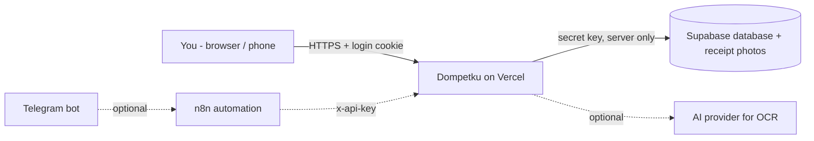

# Self-hosting Dompetku

This guide takes you from zero to your own private copy of **Dompetku** (a personal finance tracker) running on the internet. It is written for complete beginners — every step says exactly where to click and what you should see. Developers can skim the tables and jump to [Running locally](#7-running-locally-for-developers).

> [!NOTE]
> Looking for a specific setting? See [ENVIRONMENT.md](ENVIRONMENT.md). Questions? See [FAQ.md](FAQ.md). Telegram bot, reminders and backups via n8n are covered in [N8N.md](N8N.md).

## Contents

0. [Before you start](#0-before-you-start)
1. [Fork the repository](#1-fork-the-repository-on-github)
2. [Create the database (Supabase)](#2-create-the-database-supabase)
3. [Generate your secrets](#3-generate-your-secrets)
4. [Deploy to Vercel](#4-deploy-to-vercel)
5. [First-time setup inside the app](#5-first-time-setup-inside-the-app)
6. [Optional features](#6-optional-features)
7. [Running locally (for developers)](#7-running-locally-for-developers)
8. [Updating your instance](#8-updating-your-instance)
9. [Using Lovable](#9-using-lovable)
10. [Troubleshooting](#10-troubleshooting)

---

## 0. Before you start

### What you'll get

- A private web app at an address like `https://your-app.vercel.app`, protected by **your** username and password (optionally a 6-digit authenticator code).
- Your data stored in **your own** Supabase database — nobody else (including the project author) can see it.
- Optional extras: a Telegram bot to log expenses by chat or receipt photo, daily bill reminders, weekly backups to Google Drive, and error alerts.



### Time and cost

| Path                                         | Time                | Cost                                                         |
| -------------------------------------------- | ------------------- | ------------------------------------------------------------ |
| **Minimum** — web app only                   | about 20–30 minutes | Free                                                         |
| **Full** — plus bot, OCR, reminders, backups | add 1–2 hours       | Free tiers are usually enough; AI usage may cost a few cents |

Every service below has a free tier: **GitHub**, **Supabase** and **Vercel** (required); **n8n** (self-hosted is free, n8n Cloud is paid), **Telegram**, an **OpenAI-compatible AI provider** (Google AI Studio has a free tier), **Resend** and **Sentry** (all optional).

### Choose your path

> [!TIP]
> **Minimum (web app only):** do sections 1 → 5. You get the full web app: transactions, budgets, debts, subscriptions, goals, gold, receivables, reports, CSV import, manual backup/restore.
>
> **Full:** do the Minimum path, then section 6: Telegram bot, receipt OCR, automatic reminders, scheduled backups, error monitoring. Each extra is independent — add only what you want.

### Prerequisites checklist

Create these free accounts first (sign in with GitHub where offered — it saves time):

- [ ] **GitHub** — <https://github.com/signup> (stores your copy of the code)
- [ ] **Supabase** — <https://supabase.com/dashboard/sign-up> (the database)
- [ ] **Vercel** — <https://vercel.com/signup> (runs the website; choose the free _Hobby_ plan)
- [ ] A **password manager** or a safe note to store the secrets you will create

Optional, only for the Full path:

- [ ] **Telegram** app + a bot from [@BotFather](https://t.me/BotFather)
- [ ] An **n8n** instance — <https://n8n.io> (see [N8N.md](N8N.md))
- [ ] An **AI API key** — e.g. [Google AI Studio](https://aistudio.google.com/apikey), [OpenAI](https://platform.openai.com/api-keys) or [OpenRouter](https://openrouter.ai/keys)
- [ ] **Resend** — <https://resend.com> (direct email reminders)
- [ ] **Sentry** — <https://sentry.io> (error alerts)

---

## 1. Fork the repository on GitHub

A **fork** is your own copy of the project on GitHub. Vercel will build the website from your fork, and you can pull in future updates with one click.

1. Sign in to GitHub and open <https://github.com/ilramdhan/dompetku>.
2. Click **Fork** (top right).
3. Leave **Owner** as your account and the name as `dompetku` (you can rename it). Keep **Copy the `main` branch only** ticked.
4. Click **Create fork**. After a few seconds you are on `github.com/<your-username>/dompetku`.

> [!NOTE]
> **Public or private?** Forks of a public repo are public. That is fine: **your data and secrets never live in the code** — they live in Supabase and in Vercel's environment variables. If you prefer a private repo, use **Use this template** / _Import repository_ (<https://github.com/new/import>) instead of Fork; you then lose the one-click _Sync fork_ button and must pull updates manually.

**Later, to get updates:** open your fork → click **Sync fork** → **Update branch**. See [Updating your instance](#8-updating-your-instance).

---

## 2. Create the database (Supabase)

### 2.1 Create a project

1. Go to <https://supabase.com/dashboard> → **New project**.
2. Pick your organization, enter a **Project name** (e.g. `dompetku`).
3. **Database Password**: click **Generate a password** and save it in your password manager (you rarely need it, but you cannot see it again).
4. **Region**: choose the one closest to you. For Indonesia, choose **Southeast Asia (Singapore)**.
5. Click **Create new project** and wait 1–2 minutes until the dashboard is ready.

> [!IMPORTANT]
> **The Vercel region must match the Supabase region.** Every page load talks to the database several times; if the website runs in another continent, pages become slow. This repo ships a `vercel.json` with:
>
> ```json
> { "regions": ["sin1"] }
> ```
>
> `sin1` is Singapore. If your Supabase project is elsewhere, edit `vercel.json` in your fork (GitHub → open the file → pencil icon → edit → **Commit changes**) and use the matching Vercel region code, for example:
>
> | Supabase region            | Vercel region |
> | -------------------------- | ------------- |
> | Southeast Asia (Singapore) | `sin1`        |
> | Northeast Asia (Tokyo)     | `hnd1`        |
> | South Asia (Mumbai)        | `bom1`        |
> | Oceania (Sydney)           | `syd1`        |
> | West EU (Ireland)          | `dub1`        |
> | Central EU (Frankfurt)     | `fra1`        |
> | East US (North Virginia)   | `iad1`        |
> | West US (North California) | `sfo1`        |
>
> Full list: <https://vercel.com/docs/edge-network/regions>.

### 2.2 Copy your Project URL and secret key

1. In your Supabase project, click the **gear icon (Project Settings)** at the bottom of the left sidebar.
2. **Project URL**: under **Data API** (or **API**), copy the URL that looks like `https://abcdefghijkl.supabase.co`. This becomes `SUPABASE_URL`.
3. **Secret key**: under **API Keys**, copy either
   - the **Secret key** (starts with `sb_secret_…`; click _Reveal_), or
   - on older projects, the **`service_role`** key under _Legacy API keys_.

   This becomes `SUPABASE_SERVICE_ROLE_KEY`. Both formats work.

> [!WARNING]
> The secret / `service_role` key is a **master key** to your database — it bypasses all security rules. Only ever paste it into Vercel environment variables or your local `.env`. Never put it in the browser, in a screenshot, in a GitHub issue, or in a public file. Dompetku only uses it on the server. If it leaks, rotate it in Supabase (API Keys → roll / create new secret key) and update Vercel.
>
> Do **not** use the `anon` / _publishable_ key — the app will not work with it.

### 2.3 Create the tables (run `schema.sql`)

1. In your fork on GitHub, open `supabase/schema.sql` and click the **Copy raw file** button (two overlapping squares icon above the code).
2. In Supabase, open **SQL Editor** (left sidebar) → **New query**.
3. Paste the whole file and click **Run** (or press `Ctrl/Cmd + Enter`).
4. If Supabase warns about _destructive operations_ or _RLS_, click **Run this query** to confirm — the script only creates/updates things, it never deletes your data.

**What success looks like:** the result panel says **Success. No rows returned** (you may also see a small table from the last statement). In **Table Editor** you now see tables such as `accounts`, `categories`, `transactions`, `debts`, `subscriptions`, `budgets`, `goals` … and the `categories` table already has default categories.

<details>
<summary><strong>What are the sections v1 … v15?</strong></summary>

The file grew with the app. Every section uses `if not exists` / `on conflict do nothing` / `create or replace`, so **the whole file is idempotent: running it again is always safe** and never deletes data. Run the whole file each time you update.

| Section   | Adds                                                                                                                                     |
| --------- | ---------------------------------------------------------------------------------------------------------------------------------------- |
| base (v1) | Accounts, categories, transactions, debts & payments, subscriptions, budgets, goals, exchange rates; security (RLS on, no public access) |
| v2        | Receipt photo column + private Storage bucket `receipts`                                                                                 |
| v3        | Activity log, gold savings, receivables                                                                                                  |
| v4        | Transfer/admin fees, monthly account fees, subscription tax                                                                              |
| v5        | Gold metadata and indexes                                                                                                                |
| v6        | Gold linked to accounts                                                                                                                  |
| v7        | Telegram bot drafts and idempotency (`bot_drafts`, `external_id`)                                                                        |
| v8        | Savings goals linked to an account                                                                                                       |
| v9        | Report aggregation functions in Postgres (faster dashboards)                                                                             |
| v10       | Recurring transactions                                                                                                                   |
| v11       | Budget rollover and 80%/100% alerts                                                                                                      |
| v12       | Split transactions, up to 5 receipt photos, item search                                                                                  |
| v13       | Per-account report and bank reconciliation                                                                                               |
| v14       | App settings (name, logo, time zone, landing page, bot defaults)                                                                         |
| v15       | AI usage log and per-chat daily bot AI quota                                                                                             |

If a later section has not been run, the related page shows a hint instead of crashing, and the rest of the app keeps working.

</details>

<details>
<summary><strong>Common SQL errors</strong></summary>

| Error                                                                | Fix                                                                                                                                                                                                                |
| -------------------------------------------------------------------- | ------------------------------------------------------------------------------------------------------------------------------------------------------------------------------------------------------------------ |
| `permission denied for table buckets` / error near `storage.buckets` | Create the bucket by hand: **Storage → New bucket** → name `receipts`, **Public** off, file size limit 5 MB. Then run the file again. (The app also creates the bucket automatically on the first receipt upload.) |
| `syntax error at or near …`                                          | The file was not pasted completely. Select all in the editor, delete, and paste the raw file again.                                                                                                                |
| `function … does not exist` right after running                      | PostgREST caches the schema. Wait ~1 minute or run `notify pgrst, 'reload schema';`.                                                                                                                               |
| Query timed out                                                      | Run it again — it is safe to repeat.                                                                                                                                                                               |

</details>

> [!NOTE]
> **Receipt storage:** the private bucket `receipts` is created by the SQL (v2) and, if missing, lazily by the app the first time you upload a receipt. Photos are never public — the app shows them through links that expire after a few minutes.

---

## 3. Generate your secrets

You need two long random strings. Generate them on your own computer — **don't** use random "secret generator" websites.

| Variable         | Rule                       | Used for                                                        |
| ---------------- | -------------------------- | --------------------------------------------------------------- |
| `SESSION_SECRET` | at least **32** characters | signs your login cookie                                         |
| `N8N_API_KEY`    | at least **24** characters | lets n8n call the app (needed for the Full path; set it anyway) |

Run the command **twice** (once per variable) and copy each output.

**macOS / Linux** — open the _Terminal_ app and run:

```sh
openssl rand -base64 48
```

**Windows** — open _PowerShell_ (Start menu → type "PowerShell") and run:

```powershell
[Convert]::ToBase64String((1..48 | ForEach-Object { Get-Random -Minimum 0 -Maximum 256 }))
```

**No terminal?** Use your password manager's generator (1Password, Bitwarden, KeePassXC, the iCloud/Google password suggestion…): set length to **48+**, letters and numbers. That is just as good.

> [!TIP]
> Avoid characters like `"` `'` `` ` `` `$` or spaces in secrets — they cause copy/paste and shell-quoting problems. Base64 output (`A–Z a–z 0–9 + / =`) is fine.

**Choose your login:**

- `APP_USERNAME` — anything, e.g. `me`.
- `APP_PASSWORD` — a long unique password (use the password manager). There is only one user; this is the key to all your finances.

Keep these four values — plus `SUPABASE_URL` and `SUPABASE_SERVICE_ROLE_KEY` from step 2 — ready for the next step.

---

## 4. Deploy to Vercel

### 4.1 Import the project

1. Go to <https://vercel.com/new>.
2. Under **Import Git Repository**, click **Continue with GitHub** if asked, and allow Vercel to access your `dompetku` repository (you can grant access to only that repo).
3. Click **Import** next to `dompetku`.
4. **Framework Preset**: choose **Other** if Vercel picked something else. Leave **Root Directory** as `./`.
5. **Build and Output Settings**: leave them on default. Vercel detects `bun.lock` and runs `bun install` + `bun run build`; the build automatically targets Vercel (it checks the `VERCEL` variable that Vercel sets). If you override anything, the build command is `bun run build` (or `npm run build`) and the output directory must stay empty.

### 4.2 Add environment variables

Still on the import screen, open **Environment Variables** and add each row (**Key** = name, **Value** = your value, then **Add**). You can also paste a whole `.env`-style block into the Key field.

| Name                                          | Required?   | Value                                                        |
| --------------------------------------------- | ----------- | ------------------------------------------------------------ |
| `SUPABASE_URL`                                | **yes**     | Project URL from step 2.2                                    |
| `SUPABASE_SERVICE_ROLE_KEY`                   | **yes**     | Secret / service_role key from step 2.2                      |
| `APP_USERNAME`                                | **yes**     | your username                                                |
| `APP_PASSWORD`                                | **yes**     | your password                                                |
| `SESSION_SECRET`                              | **yes**     | random, ≥ 32 characters                                      |
| `N8N_API_KEY`                                 | recommended | random, ≥ 24 characters (required for bot/reminders/backups) |
| `APP_TIMEZONE`                                | optional    | e.g. `Asia/Jakarta` (the default)                            |
| `AI_API_URL`, `AI_API_KEY`, `AI_MODEL`        | optional    | receipt OCR — see [6.2](#62-receipt-ocr-and-ai-chat-parsing) |
| `BOT_ALLOWED_CHAT_IDS`, `BOT_DEFAULT_ACCOUNT` | optional    | Telegram bot — see [6.1](#61-telegram-bot)                   |
| `APP_TOTP_SECRET`                             | optional    | 2FA — see [5.5](#55-two-step-login-2fa)                      |

Every variable, with details and security notes: **[ENVIRONMENT.md](ENVIRONMENT.md)**.

### 4.3 Deploy

1. Click **Deploy**. The build takes about 1–3 minutes.
2. When you see **Congratulations!**, click **Continue to Dashboard**.
3. Your address is shown under **Domains**, e.g. `https://dompetku-yourname.vercel.app`. Bookmark it.

**Check the region:** Project → **Settings → Functions → Function Region** should show the region from `vercel.json` (Singapore `sin1` by default).

### 4.4 First login

Open your URL. You should see the **login page**. Enter `APP_USERNAME` and `APP_PASSWORD`. You land on the **Dashboard**, which is empty except for default categories. 🎉 That's the Minimum path done — continue with section 5.

> [!IMPORTANT]
> **Changing environment variables does not affect the running site until you redeploy.** After any change in **Settings → Environment Variables**: go to **Deployments** → the latest deployment → **⋯** menu → **Redeploy**.

---

## 5. First-time setup inside the app

### 5.1 Accounts

Open **Accounts** → add every place money lives: bank accounts, e-wallets, cash, credit cards, investments. Enter the **initial balance** as of today. Each account is IDR or USD.

### 5.2 Categories

Default income/expense categories are created by `schema.sql`. Manage them in **Settings → Categories** (add, rename, recolor). The bot and AI only use categories that exist — they never invent new ones.

### 5.3 Language and theme

- **ID/EN** switch in the sidebar (or the header on mobile) changes the interface language; the choice is saved in your browser.
- The **sun/moon** toggle switches light/dark mode.

### 5.4 Privacy mode

Click the **eye icon** (or press **Shift + H**) to hide all amounts, balances, charts and gold grams on this device — handy in public. Percentages and counts stay visible. Press again to reveal.

### 5.5 Two-step login (2FA)

Adds a 6-digit code from an authenticator app after your password.

1. Log in and open **Settings → Two-step verification (2FA)** → **Generate secret key**.
2. In an authenticator app (Google Authenticator, Aegis, 2FAS, 1Password, Bitwarden…), add an account → **enter the key manually** (time-based). Apps that support importing links can use the `otpauth://` URI shown below the key instead. (There is no QR code.)
3. In Vercel → **Settings → Environment Variables**, add `APP_TOTP_SECRET` = that same key.
4. **Redeploy** (see the note in 4.4).
5. **Test before logging out:** open your site in a **private/incognito window**, log in with password **and** code. Only when that works, close your normal session.

> [!WARNING]
> Save the key in your password manager as a backup. If you lose your phone, recovery is: remove or replace `APP_TOTP_SECRET` in Vercel and redeploy. Codes tolerate ±30 seconds of clock drift; wrong codes count toward the login limit (8 failures per 15 minutes).

### 5.6 Optional: import history

**Transactions → Import CSV** accepts a CSV with date, type, amount, category, account, notes, currency. You get a preview; duplicates and invalid rows are skipped.

---

## 6. Optional features

### 6.1 Telegram bot

Log expenses by chatting ("coffee 25k", "gaji 8jt ke BCA") or sending a receipt photo; each entry is previewed with ✅/❌ buttons before saving. The logic lives in the web app; **n8n** only relays messages between Telegram and the app.

1. Run `schema.sql` (v7 is included).
2. Set `N8N_API_KEY`, `BOT_ALLOWED_CHAT_IDS` (your Telegram chat ID) and optionally `BOT_DEFAULT_ACCOUNT` in Vercel → redeploy.
3. Create the bot with @BotFather and import the n8n workflows.

Full walkthrough: **[N8N.md](N8N.md)**.

> [!TIP]
> Don't know your chat ID? Leave `BOT_ALLOWED_CHAT_IDS` empty for a moment and message the bot: it refuses and replies with the chat ID to add.

### 6.2 Receipt OCR and AI chat parsing

Reads receipt photos (web **and** bot) and understands ambiguous chat messages. Any **OpenAI-compatible chat-completions** endpoint works. `AI_API_URL` must be the **full URL ending in `/chat/completions`**; the app sends `Authorization: Bearer <AI_API_KEY>` and asks for a JSON response. `AI_MODEL` must support images (vision) for receipts.

| Provider                  | `AI_API_URL`                                                               | `AI_MODEL` example                                                       | Key from                                                             |
| ------------------------- | -------------------------------------------------------------------------- | ------------------------------------------------------------------------ | -------------------------------------------------------------------- |
| Google Gemini (free tier) | `https://generativelanguage.googleapis.com/v1beta/openai/chat/completions` | `gemini-2.5-flash` (cheaper text: `AI_MODEL_TEXT=gemini-2.5-flash-lite`) | [aistudio.google.com/apikey](https://aistudio.google.com/apikey)     |
| OpenAI                    | `https://api.openai.com/v1/chat/completions`                               | `gpt-4o-mini`                                                            | [platform.openai.com/api-keys](https://platform.openai.com/api-keys) |
| OpenRouter                | `https://openrouter.ai/api/v1/chat/completions`                            | `google/gemini-2.5-flash`                                                | [openrouter.ai/keys](https://openrouter.ai/keys)                     |
| Ollama (local)            | `http://localhost:11434/v1/chat/completions`                               | a vision model, e.g. `llama3.2-vision`                                   | any non-empty value, e.g. `ollama`                                   |

> [!NOTE]
>
> - If `AI_API_URL` is empty the app falls back to the Lovable AI gateway, which only works when the project runs on Lovable. On Vercel, always set `AI_API_URL`.
> - Ollama on `localhost` only works for **local development**. Vercel cannot reach your computer unless you expose Ollama through a public HTTPS tunnel.
> - `BOT_TEXT_AI` controls when chat uses AI: `auto` (only ambiguous messages — default), `always`, or `never` (zero AI tokens for chat). Chats with no amount (digits or words like "dua puluh ribu", "goceng") or over 300 characters never reach AI.
> - `BOT_AI_DAILY_LIMIT` caps bot AI calls (chat + photo OCR) per chat per day — default `50`, `0` = unlimited. Every AI call is logged in `ai_usage` (schema v15).

### 6.3 Email reminders (Resend)

Two options:

- **Through n8n** (no extra variables): n8n reads `GET /api/public/n8n/reminders-email` and sends it with its own Email/Gmail node. See [N8N.md](N8N.md).
- **Directly via Resend:** create an account at <https://resend.com>, verify a domain, create an API key, then set `RESEND_API_KEY`, `EMAIL_FROM` (e.g. `Dompetku <noreply@mail.example.com>`) and `EMAIL_TO` in Vercel → redeploy. A scheduler (e.g. n8n) then calls `POST /api/public/n8n/reminders-send-email`.

### 6.4 Backups

- **Manual:** **Settings → Data backup → Download backup (JSON)**. **Restore from backup** accepts that file (merge or replace-all mode).
- **Scheduled:** import `n8n/05-dompetku-backup.json` into n8n — weekly backup to Google Drive (or email). See [N8N.md](N8N.md).

### 6.5 Error monitoring (Sentry)

Server errors are always written as one JSON line to **Vercel → Logs** (filter for `"level":"error"`). To also get alerts, create a project at <https://sentry.io>, copy the **DSN** (Project Settings → Client Keys), set `SENTRY_DSN` in Vercel → redeploy, then configure alerts in Sentry.

---

## 7. Running locally (for developers)

**Requirements:** [Node.js 22](https://nodejs.org) and [Bun](https://bun.sh) (`bun.lock` is the lockfile and CI uses Bun). npm also works.

```sh
git clone https://github.com/<your-username>/dompetku.git
cd dompetku
cp .env.example .env        # then fill in at least the required values
bun install                 # or: npm install
bun run dev                 # or: npm run dev
```

Open <http://localhost:8080> (the dev server port set by the Vite config).

> [!TIP]
> Use a **separate Supabase project** for development so experiments never touch your real data. The login cookie is `Secure`; browsers accept that on `http://localhost`, but not on a LAN IP over plain HTTP.

| Task                | Command                                                                                      |
| ------------------- | -------------------------------------------------------------------------------------------- |
| Lint                | `bun run lint`                                                                               |
| Typecheck           | `bun run typecheck`                                                                          |
| Unit tests          | `bun run test` (watch mode: `bun run test:watch`)                                            |
| Production build    | `bun run build`                                                                              |
| Format              | `bun run format`                                                                             |
| Regenerate DB types | `SUPABASE_PROJECT_ID=<ref> bun run gen:types` (needs the Supabase CLI: `npx supabase login`) |

CI (`.github/workflows/ci.yml`) runs lint, typecheck, test and build on every pull request and push to `main` — keep all four green. Architecture and conventions: [ARCHITECTURE.md](ARCHITECTURE.md) and [AGENTS.md](../AGENTS.md).

### Regenerating screenshots

The README and landing page images in `public/screenshots/` are captured from the local demo stack
(fictional data only, see [DEMO-DATA.md](DEMO-DATA.md)). With the dev server running on port 8080:

```sh
npm run db:up && npm run seed:demo -- --reset && npm run screenshots
```

Details: [DEMO-DATA.md → Regenerating screenshots](DEMO-DATA.md#regenerating-screenshots).

---

## 8. Updating your instance

1. On GitHub, open your fork → **Sync fork** → **Update branch**.
2. Vercel notices the new commit and **deploys automatically** (watch **Deployments**).
3. Open Supabase **SQL Editor** and run the latest `supabase/schema.sql` again — it's safe and adds any new tables or columns.
4. Read [CHANGELOG.md](../CHANGELOG.md) for new environment variables or n8n workflow changes.

> [!NOTE]
> If you edited files in your fork (e.g. `vercel.json`), _Sync fork_ may report a conflict. Choose **Discard commits** only if you are happy to redo your edits; otherwise open a pull request from the upstream repo into your fork and resolve the conflict there.

---

## 9. Using Lovable

This project was originally built with [Lovable](https://lovable.dev) and still works there: `vite.config.ts` targets Lovable's runtime by default and switches to the Vercel target only when the `VERCEL` variable is present. You can import your fork into Lovable to edit it with AI; on Lovable the AI gateway (`LOVABLE_API_KEY`) is available, so `AI_API_URL` can stay empty. You still need Supabase and the same server environment variables (as Lovable secrets).

---

## 10. Troubleshooting

| Symptom                                                                                               | Likely cause                                                                                                                                              | Fix                                                                                                                                                                    |
| ----------------------------------------------------------------------------------------------------- | --------------------------------------------------------------------------------------------------------------------------------------------------------- | ---------------------------------------------------------------------------------------------------------------------------------------------------------------------- |
| Error page mentioning `SUPABASE_URL dan SUPABASE_SERVICE_ROLE_KEY belum diatur`                       | Database variables missing                                                                                                                                | Add both in Vercel → redeploy.                                                                                                                                         |
| Login fails with `SESSION_SECRET belum diatur (minimal 32 karakter)`                                  | `SESSION_SECRET` missing or shorter than 32 characters                                                                                                    | Generate a new one (step 3) → redeploy.                                                                                                                                |
| Login fails with `APP_USERNAME dan APP_PASSWORD belum diatur`                                         | Login variables missing                                                                                                                                   | Add them → redeploy.                                                                                                                                                   |
| Correct password but you're sent back to the login page (login loop)                                  | Cookie blocked: site opened over plain `http://` (not localhost), browser blocks third-party/partitioned cookies in an embed, or `SESSION_SECRET` changed | Use the `https://` URL directly (not inside an iframe), allow cookies for the site, log in again after changing secrets.                                               |
| "Unauthorized" toasts / data won't load                                                               | Session expired (7 days) or `SESSION_SECRET` changed (all sessions invalidated)                                                                           | Reload and log in again.                                                                                                                                               |
| Login refused as locked / too many attempts                                                           | 8 failed logins in 15 minutes                                                                                                                             | Wait 15 minutes.                                                                                                                                                       |
| 2FA code always rejected                                                                              | Phone clock wrong, or wrong key in `APP_TOTP_SECRET`                                                                                                      | Enable automatic time on the phone; re-enroll; settings page shows when the key is invalid. Remove `APP_TOTP_SECRET` + redeploy to disable.                            |
| Pages are slow (1–3 s per click)                                                                      | Vercel region far from Supabase region                                                                                                                    | Make `vercel.json` `regions` match your Supabase region ([2.1](#21-create-a-project)) → redeploy.                                                                      |
| Error `relation "public.…" does not exist`, or a page shows a "run the schema" hint / features hidden | `schema.sql` not run, or only partially                                                                                                                   | Run the whole `supabase/schema.sql` again (safe).                                                                                                                      |
| `function dk_… does not exist`                                                                        | Schema cache not refreshed                                                                                                                                | Wait a minute or run `notify pgrst, 'reload schema';`. The app falls back to slower JS sums meanwhile.                                                                 |
| n8n gets **503** `N8N_API_KEY belum diatur di server`                                                 | `N8N_API_KEY` missing or shorter than 24 characters                                                                                                       | Set a ≥ 24-char key → redeploy.                                                                                                                                        |
| n8n gets **401** `Unauthorized`                                                                       | The `x-api-key` header in n8n doesn't match Vercel's `N8N_API_KEY`                                                                                        | Copy the exact value into the n8n _Header Auth_ credential (no spaces/newlines).                                                                                       |
| Bot doesn't answer at all                                                                             | n8n workflow not active, webhook not set, or Telegram filter in n8n                                                                                       | See [N8N.md](N8N.md) troubleshooting; check n8n executions.                                                                                                            |
| Bot replies "add chat_id … to BOT_ALLOWED_CHAT_IDS"                                                   | Allow-list is empty or doesn't contain your chat — **fails closed** by design                                                                             | Add the chat ID shown (comma-separated) → redeploy.                                                                                                                    |
| OCR: `AI_API_KEY belum diatur untuk fitur OCR`                                                        | No AI key                                                                                                                                                 | Set `AI_API_KEY` (and `AI_API_URL`, `AI_MODEL`) → redeploy.                                                                                                            |
| OCR: `Gagal membaca dengan AI [404]` / `[400]`                                                        | Wrong `AI_API_URL` (must end with `/chat/completions`) or model name not valid for that provider                                                          | Check the table in [6.2](#62-receipt-ocr-and-ai-chat-parsing); Gemini direct uses `gemini-2.5-flash` (no `google/` prefix), OpenRouter uses `google/gemini-2.5-flash`. |
| OCR: `[401]` / `[403]`                                                                                | Invalid or restricted API key                                                                                                                             | Create a new key at the provider.                                                                                                                                      |
| OCR: "AI usage limit reached" (429) / "AI credit exhausted" (402)                                     | Provider rate limit or no credit                                                                                                                          | Wait, add credit, or switch model.                                                                                                                                     |
| Bot photo fails with **413**                                                                          | Request body over Vercel's 4.5 MB limit                                                                                                                   | Send a smaller/compressed photo.                                                                                                                                       |
| Restoring a big backup                                                                                | Vercel limits each request to 4.5 MB                                                                                                                      | Already handled: the app uploads restores in chunks (≤ 500 rows / ≤ 2 MB). Backup files up to 20 MB are accepted.                                                      |
| Bot OCR times out on Vercel                                                                           | Function time limit                                                                                                                                       | `vite.config.ts` gives `/api/public/n8n/bot` 60 s; make sure your Vercel plan allows it.                                                                               |
| Reminders/"today" off by a day                                                                        | Time zone                                                                                                                                                 | Set `APP_TIMEZONE` (and the same zone in n8n).                                                                                                                         |
| Supabase project "paused"                                                                             | Free projects pause after about a week without activity                                                                                                   | Restore it in the Supabase dashboard; see [FAQ](FAQ.md#data-backup-and-deletion).                                                                                      |
| Build fails on Vercel                                                                                 | Wrong framework preset or overridden output directory                                                                                                     | Preset **Other**, default build settings, empty output directory. Check the build log for the first red error.                                                         |

Still stuck? Look at **Vercel → Logs** (errors are JSON lines with a `scope`), then open an issue on GitHub — **remove any keys, URLs or personal data** first.
